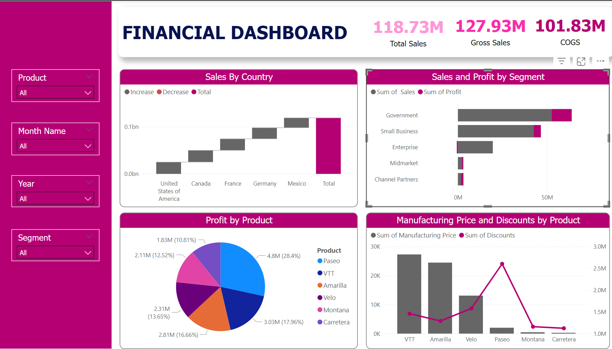

# Financial_and_Behavioral_Analysis

## Introduction

This project aimed to leverage customer data to segment the audience, understand different behaviors, and identify high-value customer groups. The insights will enable targeted marketing and personalized engagement strategies.

## Problem Statement

1.	What is the total sales revenue for each year?
2.	Which countries contribute the most to gross sales?
3.	Which segments (e.g., Government, Midmarket) generate the most profit?
4.	Which products have the highest units sold?
5.	What is the profit margin for each product?

## Data
**Dataset Overview:**
1.	Segment: Business segment.
2.	Country: Country where sales occurred.
3.	Product: Product sold.
4.	Discount Band: Discount range applied to sales.
5.	Units Sold: Number of units sold (currently formatted as a string with a dollar sign).
6.	Manufacturing Price, Sale Price, Gross Sales, Discounts, Sales, COGS (Cost of Goods Sold), Profit: Financial details (formatted as strings with dollar signs).
7.	Date: Transaction date.
8.	Month Number, Month Name, Year: Time details.

*You can access the dataset [here](https://github.com/kouatcheu1/Financial_and_Behavioral_Analysis/blob/main/Sales_data1.csv)*

## Skills demonstrated
- Data Collection and Normalization (SQL)
- Exploratory Data Analysis (EDA) (SQL)
- Behavioral Analysis (Python)
- Interactive Dashboard Creation (Power Bi and Tableau)

## Visualization 📊

Data visualization was created with power bi and Tableau using different charts to highlight hidden insights from the data.

**Features**:
- The total sales, Cost of goods sold and Gross sales are (118.73M, 101.83M, 127.93M) respectively.
- Water fall chart for the Sales by Country which derived that the United States of America has the highest sales among the five present countries while Mexico had lowest sales.
- Pie Chart for the profit by product which derived that Five products were present and Paseo had the highest sales out of all product while Carettera had lowest sales.
- Stacked bar char for the sales and profit by segment which derived from the Four segments available; Government had highest sales while Channel Partners had lowest sales. Government had highest profit, there’s a decline of profit in Enterprise.
- Four slicers were used to filter the records which are: Product, Month name, Segment, Year.

_You can interact with the Power BI dashboard_ [here](https://app.powerbi.com/groups/me/reports/f16ffce9-871c-424b-b120-21a2410d89f4/ReportSectionf63e04f122eaa0196717?experience=power-bi)

## Analysis 📉📈

o **Exploratory Data Analysis (EDA) was performed using SQL and the following were derived:**
- The total sales revenue for each year.
**Result**: 2014’s total sales is: 91455134 while 2013’s total sales is: 26415255
- Countries with the highest cotribution to sales.
**Result**: United states of America contributed the most to gross sales with value of '27269359'.
- Segment that generated higest profit.
**Result**: Government generated the higest profit in the sales data with value of '11388184'.
- Product with highest unit sold.
**Result**: Out of the six available products, Paseo has the highest units sold with value '333317'.
  
 *You can access the SQL scripts file* [here](https://github.com/kouatcheu1/Financial_and_Behavioral_Analysis/blob/main/SQL_Analysis.sql)
 
o **Behavioral Analysis was performed using Python and the following were derived:**
- Segment that contributed the most to sales and profit.
**Result**: From the result Government contributed the most to the sales and profit among the five segment available.
- Countries that generated the most revenue and have the highest sales volume.
**Result**: From the result United States of America has the highest sales out of the five different countries available while Canada has highest sales volume. 
A chart is generated to display the analysis.
- The top-performing products by sales and profit.
**Result**: Using Top 3 items, Paseo, VTT and Velo are the top three products respectively. Paseo with the highest sales and profit while Montana has the lowest sales and profit.
- The Average Order Value (AOV) variation across segments and countries.
**Result**: From the result AOV by Segments shows that small business had highest AOV while channel partners had lowest AOV. Comparison by country shows that United States of America had highest AOV while Mexico had lowest AOV.

*You can access the Python file* [here](https://github.com/kouatcheu1/Financial_and_Behavioral_Analysis/blob/main/Behavioral_Analysis.ipynb)

## Summary

This report provides an in-depth analysis of sales and performance data across business segments, countries, and products. Key metrics such as revenue, profit, average order value (AOV), and sales volume were explored to identify drivers of growth and profitability. Using SQL, Python, Power BI, and Tableau, insights were derived to inform decision-making and strategic planning.

**Key findings include:**
- Top Segment: The Government segment generated the highest sales and profit.
- High-Revenue Country: The United States of America contributed the most to gross sales and AOV, while Canada led in sales volume.
- Best-Selling Product: Paseo emerged as the top-performing product in both sales and profit.
- Yearly Sales Growth: Sales grew significantly from $26.41M in 2013 to $91.46M in 2014.
- Data Quality: No missing values were identified in critical columns, and the data was normalized and standardized for consistency and analysis.

## Conclusion

- **Revenue and Profit Drivers**
The Government segment is the primary contributor to sales and profitability.
The United States leads in revenue generation and average order value, with significant sales volume from Canada.

- **Product Performance**
Paseo is the standout product, followed by VTT and Velo.
Montana and Carettera underperformed in sales and profit.

- **Order Value Insights**
Small businesses recorded the highest average order value, while channel partners had the lowest.
A similar trend was observed for countries, with the United States leading in AOV and Mexico at the bottom.

- **Sales Growth**
Substantial sales growth was observed between 2013 and 2014, highlighting successful strategies implemented during this period.

- **Dashboard Insights**
Visualizations revealed key performance patterns, with filters for product, month, segment, and year enabling detailed analysis.

## Recommendations

1. **Focus on High-Performing Segments and Products**
• Invest in the Government segment and prioritize marketing for top-performing products like Paseo, VTT, and Velo.
• Reassess strategies for low-performing products such as Montana and Carettera to improve their profitability.

2. **Enhance Market Penetration**
• Strengthen efforts in the United States to maximize its revenue potential.
• Develop initiatives to boost sales and AOV in Mexico, where performance is weakest.

3. **Optimize Channel and Segment Performance**
• Investigate declining profitability in the channel partner and enterprise segments to address performance gaps.

4. **Leverage Sales Growth Trends**
• Analyze and replicate strategies that contributed to the significant growth in 2014.
• Target key segments and regions with tailored campaigns to sustain sales momentum.

5. **Improve Discount Strategies**
• Evaluate the impact of discount bands on profitability and refine them to strike a balance between competitive pricing and revenue generation.

6. **Adopt Real-Time Monitoring with Dashboards**
• Utilize interactive dashboards for ongoing sales tracking, enabling proactive decision-making.
• Include filters and metrics that highlight segment, product, and regional performance for immediate insights.

By implementing these recommendations, the organization can capitalize on its strengths 💪, address areas of improvement ✒️ , and achieve sustainable growth 📈🙂.

